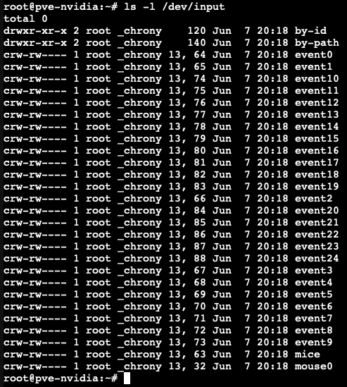
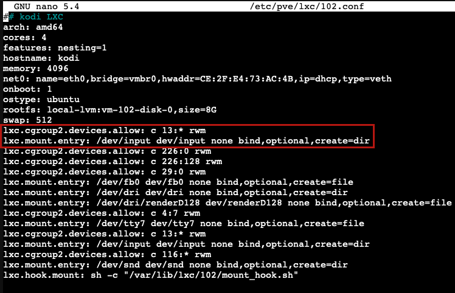
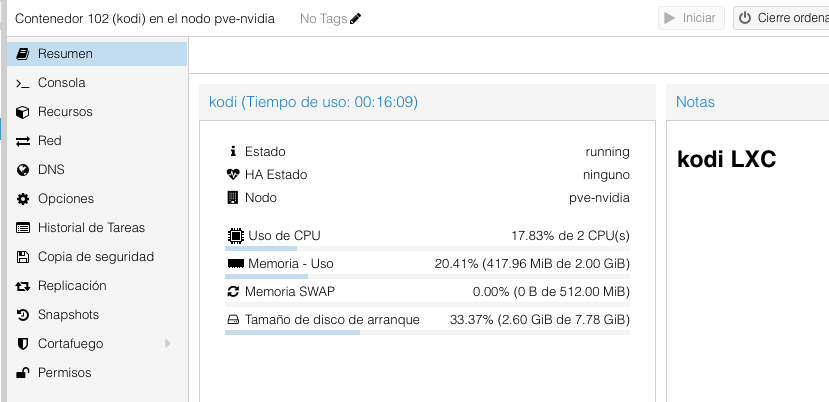
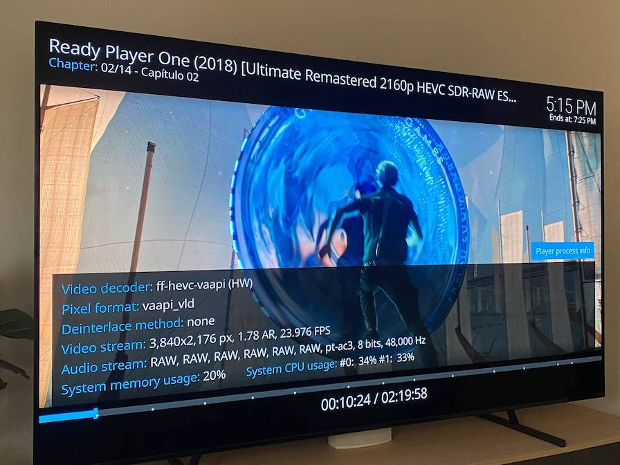

# Instalar Kodi en un LCX y conectarlo a un monitor/tv usando la aceleración grafica GPU.

En este manual vamos a ver como de manera muy sencilla podemos instalar Kodi en un LCX usando los recursos de nuestros Proxmox y poder conectarlo a nuestra televisión usando la aceleración grafica y convirtiendo a nuestros servidor con Proxmox en un servidor todo en uno.

Para ella vamos a instalar en el script que ha creado el usuario
 [mrrudy](https://github.com/mrrudy)
 
 Para que después de la instalación podamos usar el teclado, ratón o algún mando USB debemos instalar el contenedor con privilegios.
 
 ```
 bash -c "$(wget -qLO - https://raw.githubusercontent.com/mrrudy/proxmoxHelper/main/ct/kodi-v1.sh)"
 ```
Paciencia tarda en instalarse.
El acceso a tty7 quiere decir que ya le podemos conectar nuestro monitor o tv.
#

### Teclado, ratón o mando USB.

El teclado, ratón o los mandos USB son /dev/input para añadirlo la LXC debemos saber que código tiene:

 ```
ls -l /dev/input
 ```
 
 


En mi caso el código es el 13

Anadimos a la configuracion de nuestro LXC:
Por ejemplo el 102 es el id de mi contenddor Kodi

 ```
nano /etc/pve/lxc/102.conf
 ```
 ```
lxc.cgroup2.devices.allow = c 13:* rwm 
lxc.mount.entry: /dev/input dev/input none bind,optional,create=dir
 ```

 
 
 
Cuando terminemos, reiniciamos Proxmox:

 ```
 reboot
  ```
 
 
 
 #

### Actualizar Kodi.

Dentro del contenedor en la consola:

 ```
sudo add-apt-repository ppa:team-xbmc/ppa
 ```
 ```
sudo apt install kodi kodi-bin
 ```

Cuando termine reiniciamos y cuando arranque ya tendremos Kodi actualizado.

### Imagenes.
<br>

 
 
 <br>
 
 
 
<br>

Podemos saber mas de como configurar un LXC con Intel GPU en el blog de [Konpat](https://blog.konpat.me/dev/2019/03/11/setting-up-lxc-for-intel-gpu-proxmox.html)

Enjoy!!

Un tutorial de Proxmology.
