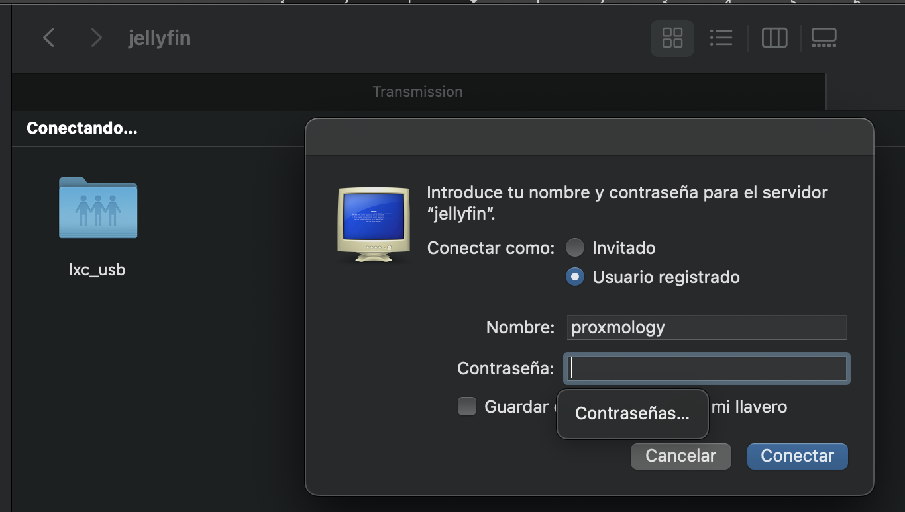
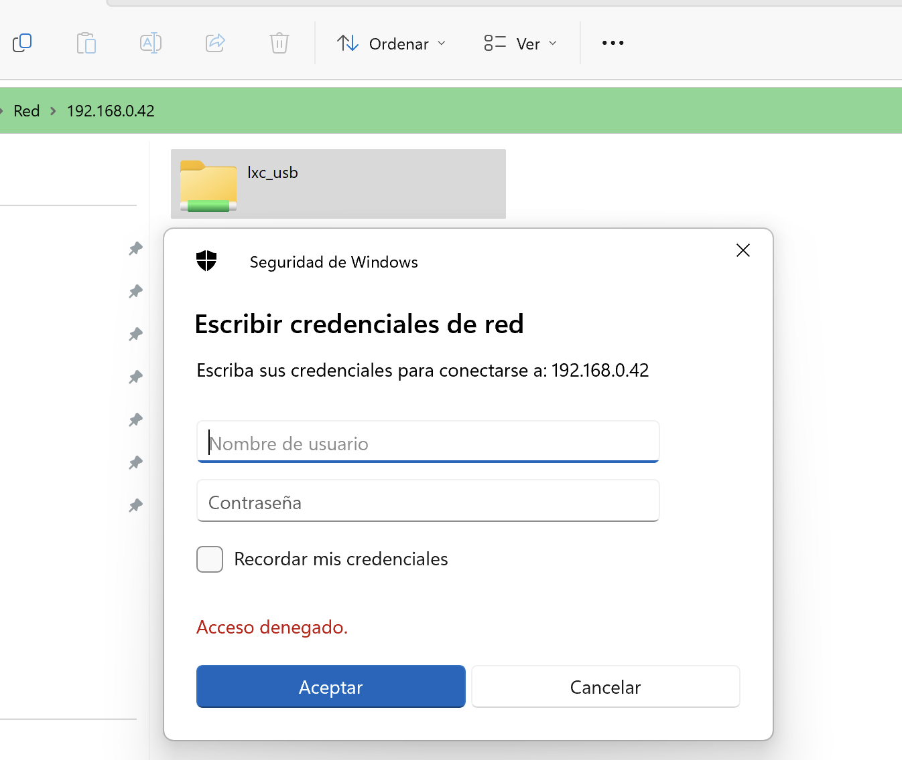

# Como añadir un disco duro USB a un LXC para usarlo y compartirlo por red.

En alguna ocasión, nos puede ser útil añadir un disco duro USB de los tradicionales con carcasa a nuestro proxmox, sobre todo si lo que tenemos es un mini pc que no tiene posibilidad de expansión.
En esta ocasión vamos a ver como añadir un disco duro USB a un LXC en el que usaremos y además compartiremos el contenido mediante samba. Para que podamos añadir el disco el LXC tiene que ser con privilegios.
Los usos pueden ser varios, para alojar archivos Torrent y tenerlos disponibles en red, para usarlo con nuestro servidor multimedia, para usarlo para alojar documentos que se auto escanean con paperless… ect.


- Instalaremos Samba.
- Añadiremos el disco USB y lo compartiremos
  
<br>
<br>

1- Instalamos samba:

```
apt-get install samba -y
```

* Confirmamos el servicio:

```
systemctl status smbd.service
```

* Creamos un nuevo usuario con el nombre que queramos, añadimos una contraseña para el usuario y confirmamos todo.

```
adduser proxmology
```

* Ahora vamos añador el nuevo usuario a samba:

```
smbpasswd -a proxmology
```

* establecemos los permisos del usuario proxmology a la ruta donde motaremos el disco y lo compartiremos.
```
apt-get install acl
```
```
setfacl -R -m "u:proxmology:rwx" /mnt/lxc_USB
```

* editamos el archivo smb.conf para compartir el directorio del disco.

```
nano /etc/samba/smb.conf
```

* al final del archivo añadimos 
```
[lxc_usb]
    comment = carpeta compartida
    path = /mnt/lxc_USB
    read only = no
    writable = yes
    browseable = yes
    guest ok = no
    valid users = @proxmology
```
<br>

##

Ya temenos instalado nuestro servidor smb, Podemos comprobar que accedemos a el.

<br>



<br>



##

## Añadir disco USB a nuestro LXC


1.	Identificamos el disco USB.

Para ello es tan sencillo y fijarnos que discos tenemos en nuestros servir antes de conectar el disco USB.

 - Antes de añadir nuestro disco

<br>


<br>

 - Después de añadir nuestro disco USB

<br>


<br>

2.	Para que podamos usarlo tenemos que formatearlo en ext4

Una vez identificado, lo formateamos para que así podamos usar sin problemas nuestro disco y podamos tanto leer como escribir en el. 

mkfs.ext4 /dev/sdb1


3.	Creamos el directorio de montaje en el LXC que queramos usar.

Podemos nombrar el directorio como queramos.

mkdir /mnt/lxc_USB

4.	Creamos un punto de montaje en nuestro LXC para añadirle el disco USB

mp0: /dev/sdb1,mp=/mnt/lxc_USB,backup=0

5.	Arrancamos el LCX 
Nos logueamos y le damos permisos al directorio de montaje


chmod -R 777 /mnt/lxc_USB


ahora ya Podemos usar nuestros disco duro usarlo dentro del contenedor y ademas compartir el su contenido


