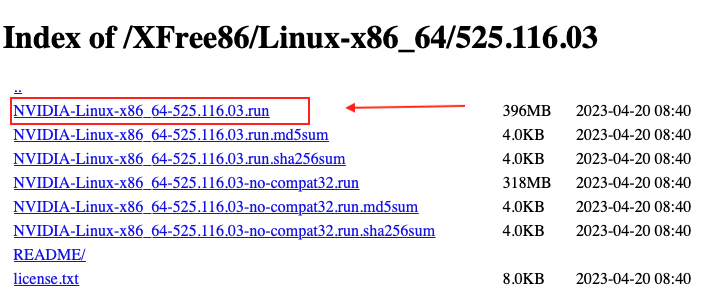
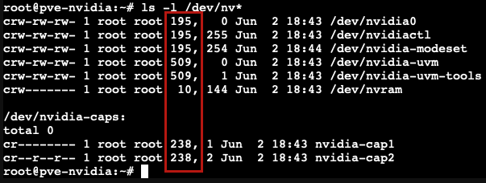

# Instalar drivers de tarjeta grafica Nvidia en Promox
Antes de empezar quiero agradecer al compañero @juanlu13 por promocionarme la [fuente original](https://forums.plex.tv/t/plex-hw-acceleration-in-lxc-container-anyone-with-success/219289/34?utm_source=pocket_mylist) de la cual se basa este manual. 
#
Este manual vamos a instalar los drivers de Nvidia, el servicio persistente y un parche opcional para para eliminar las sesiones de codificación máxima.


- Instalaremos los drives Nvidia en el host de Proxmox.
-	Configuraremos los drives para poder usarlos en cualquier LXC.

Para poder realizar la instalación debemos:
<br>
<br>
1- poner en la lista negra el controlador de "nouveau" si no lo tenemos ya. Si ya lo tenemos podemos saltarnos este paso.

Lo podemos comprobar asi: 
```
Cat /etc/modprobe.d/blacklist.conf
```
En la imagen de ejemplo muestra que si que esta añadido a la lista negra "blacklist nouveau"


Si no muestra: blacklist nouveau

Lo añadimos para que no lo use y podemos instalar el driver de Nvidia.

```
echo "blacklist nouveau" >> /etc/modprobe.d/blacklist.conf
```
```
reboot
```

2- Asegurarnos que tenemos estos repositorios configurados:

(*Si tenemos instalado el script post instalación de  [tteck](https://tteck.github.io/Proxmox/) o el de [xshok](https://github.com/extremeshok/xshok-proxmox), podemos saltarnos este paso ya que nos es necesario puesto que están añadidos estos repositorios.*)

```
nano /etc/apt/sources.list
```
```
deb http://ftp.debian.org/debian bullseye main contrib
deb http://ftp.debian.org/debian bullseye-updates main contrib
deb http://security.debian.org/debian-security bullseye-security main contrib
deb http://download.proxmox.com/debian/pve bullseye pve-no-subscription
```
Actualizamos los paquetes y promox

```
apt update && apt dist-upgrade -y
```

Antes de empezar, instalamos dos paquetes que necesitaremos, git y los encabezados del kernel para poder instalar los drivers:

```
apt-get install git
```
```
apt-get install -qqy pve-headers-`uname -r` gcc make 
```
## 1 - Instalar los drivers de Nvidia en el host de Proxmox

### - Driver:

Para empezar, necesitamos saber cual es el ultimo controlador estable disponible:*
<br>

(*Si vamos a instalar el parche para saltarnos el limite de codificaciones máximas, tenemos que tener en cuenta que ese parche este disponible para la versión del controlador que vamos a instalar.*) Podemos verlo [aquí](https://github.com/keylase/nvidia-patch).
```
https://download.nvidia.com/XFree86/Linux-x86_64/latest.txt 
```
Cuando nos muestre el resultado, copiamos el numero y los sustituimos por “/latest.txt”

Por ejemplo así: 

```
https://download.nvidia.com/XFree86/Linux-x86_64/525.116.03/
```

Una vez dentro del directorio copiamos el enlace del instalador que termina con la extensión .run





Por ejemplo:
```
https://download.nvidia.com/XFree86/Linux-x86_64/525.116.03/NVIDIA-Linux-x86_64-525.116.03.run
```

#### Empezamos con la instalación:

```
mkdir /opt/nvidia
```
```
cd /opt/nvidia
```
Descargamos el controlador que copiamos antes.
```
wget https://download.nvidia.com/XFree86/Linux-x86_64/525.116.03/NVIDIA-Linux-x86_64-525.116.03.run
```
Le damos permisos de ejecución.
```
chmod +x NVIDIA-Linux-x86_64-525.116.03.run
```
ejecutamos.
```
./NVIDIA-Linux-x86_64-525.116.03.run --no-questions --ui=none --disable-nouveau
```
Una vez terminado reiniciamos.
```
reboot
```
Una vez reiniciado proxmox continuamos con la intalación. Ejecutamos:
```
/opt/nvidia/NVIDIA-Linux-x86_64-525.116.03.run --no-questions --ui=none
```

Ahora añadimos a etc/modules:
```
nano /etc/modules-load.d/modules.conf
```
```
vfio
vfio_iommu_type1
vfio_pci
vfio_virqfd
nvidia
nvidia_uvm
```
Guardamos:
ctrl + x.

<br>

Actualizamos initramfs:
```
update-initramfs -u
```
A continuación creamos reglas para cargar los controladores en el arranque para nvidia y nvidia_uvm:
```
nano /etc/udev/rules.d/70-nvidia.rules
```
Pegamos:
```
# /etc/udev/rules.d/70-nvidia.rules
# Create /nvidia0, /dev/nvidia1 … and /nvidiactl when nvidia module is loaded
KERNEL=="nvidia", RUN+="/bin/bash -c '/usr/bin/nvidia-smi -L'"
#
# Create the CUDA node when nvidia_uvm CUDA module is loaded
KERNEL=="nvidia_uvm", RUN+="/bin/bash -c '/usr/bin/nvidia-modprobe -c0 -u'"
```
Guardamos: ctrl + x

<br>

### - NVIDIA driver persistence:

Ahora instalamos NVIDIA driver persistence:
```
Install GitHub - NVIDIA/nvidia-persistenced: NVIDIA driver persistence daemon
git clone https://github.com/NVIDIA/nvidia-persistenced.git
cd nvidia-persistenced/init
./install.sh
```
```
rebbot
```

Comprobamos que el controlador este instalado y el servicio este ejecutándose:
```
nvidia-smi
```

```
systemctl status nvidia-persistenced
```


### - Parche:

Ahora como opcion, parcheamos el controlador nvidia para eliminar las sesiones de codificación máxima. Según el desarrollador el parche NVENC elimina la restricción sobre la cantidad máxima de sesiones de codificación de video NVENC simultáneas impuestas por Nvidia a las GPU de nivel de consumidor.

```
cd /opt/nvidia
git clone https://github.com/keylase/nvidia-patch.git
cd nvidia-patch
./patch.sh
```


<br>

## 2- Configurar los drives para poder usarlos en cualquier LXC.

Primeramente necesitamos obtener estos datos:
```
ls -l /dev/nv*
```



Pongamos por ejemplo que vamos a usar el LXC de Plex del scrip de tteck con ID100. Si lo tenemos ejecutado lo apagamos.
```
nano /etc/pve/lxc/100.conf
```
Pegamos esto dentro del archivo de configuración del LXC

```
lxc.cgroup2.devices.allow: c 195:* rwm
lxc.cgroup2.devices.allow: c 509* rwm
lxc.cgroup2.devices.allow: c 10:* rwm
lxc.cgroup2.devices.allow: c 238:* rwm
lxc.mount.entry: /dev/nvidia0 dev/nvidia0 none bind,optional,create=file
lxc.mount.entry: /dev/nvidiactl dev/nvidiactl none bind,optional,create=file
lxc.mount.entry: /dev/nvidia-uvm dev/nvidia-uvm none bind,optional,create=file
lxc.mount.entry: /dev/nvidia-modeset dev/nvidia-modeset none bind,optional,create=file
lxc.mount.entry: /dev/nvidia-uvm-tools dev/nvidia-uvm-tools none bind,optional,create=file
lxc.mount.entry: /dev/nvram dev/nvram none bind,optional,create=file
```
